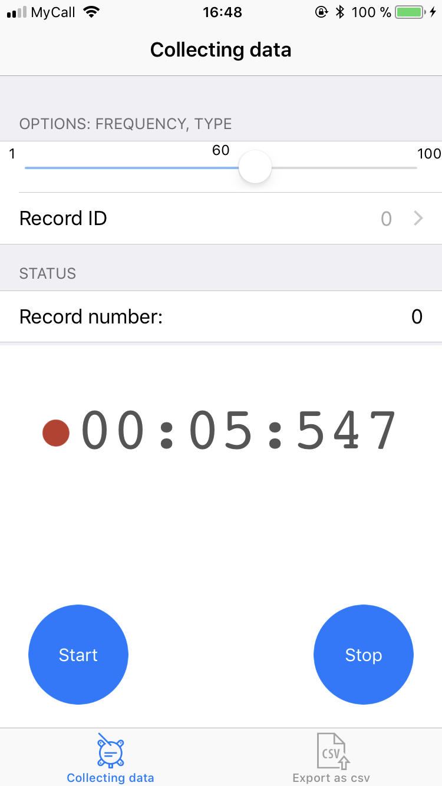
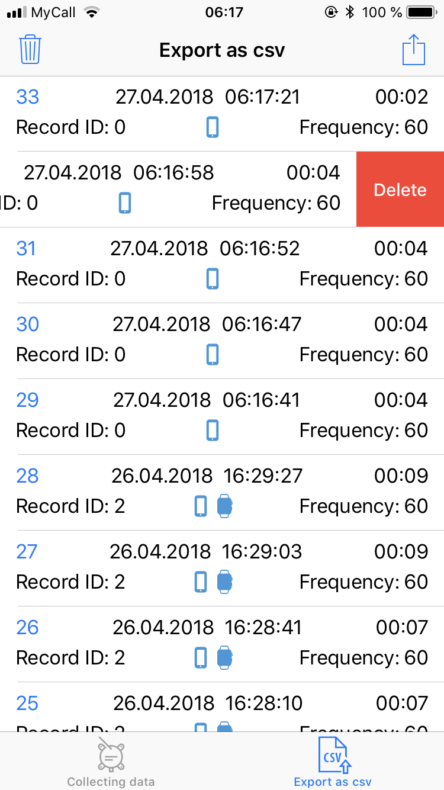
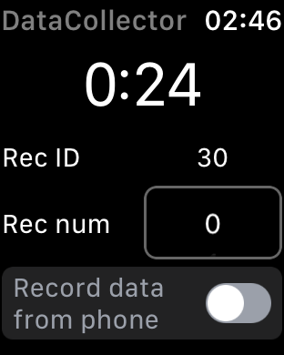
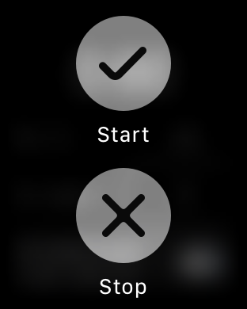

# iOS Motion Collector
iOS application for collecting data from iApple Watch's sensors (gyroscope, accelerometer). Each session could be marked by record label for example, to mark Bear Walk session as record id = 'Bear' and Spider Climbing session as record id = 'Spider'. The result could be exported as *.csv file that contains all the sessions.

# Screenshots

  
  

  
  

